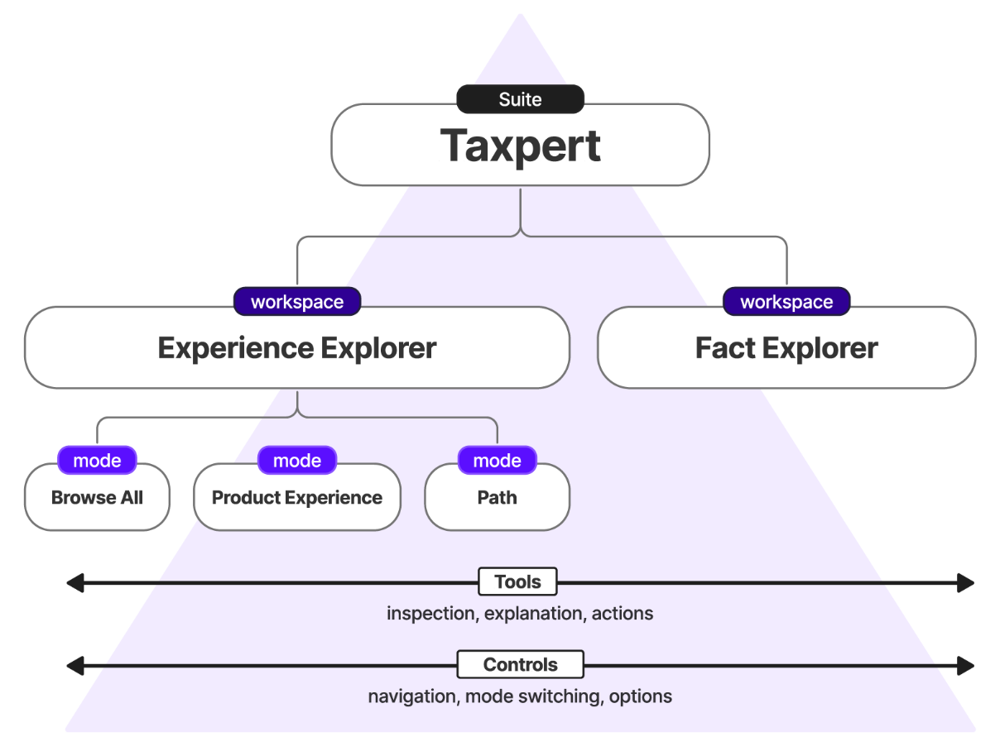

# Taxpert
## Overview
Taxpert is a suite of internal tools that helps teams understand and validate complex questionnaire software by making the rules and relationships of [Form Builder](https://github.com/IRS-Public/form-builder) and [Fact Graph](https://github.com/IRS-Public/fact-graph) applications easier to inspect. 
It achieves this as a drop-in UI library, adding a lightweight workspace wrapper around a running Form Builder or Fact Graph application. 

Read the full [Why Taxpert](docs/why-taxpert.md) for the rationale, supporting research, and future direction of Taxpert.
See [below](#capabilities) for a description of what capabilities are included in Taxpert today and at what level of 
stability/maturity. See the [docs](docs), in particular [Onboarding](docs/onboarding.md), [Architecture](docs/architecture.md), and [Taxpert vs. Form Builder vs. Fact Graph](docs/adr/taxpert-form-builder-fact-graph.md) to learn more about how Taxpert works.

If you are interested in building your own Form 
Builder and Fact Graph application and customizing Taxpert to your needs, check out [Form Builder Template](https://github.com/IRS-Public/form-builder-template). Example applications 
built on [Form Builder](https://github.com/IRS-Public/form-builder), [Fact Graph](https://github.com/IRS-Public/fact-graph), and [Taxpert](https://github.com/IRS-Public/taxpert) can be found at 
[Form Builder Examples](https://github.com/IRS-Public/form-builder-examples).

> The code in this repository addresses concrete friction points that arise during the development and maintenance of Fact Graph applications. 
> Our primary focus is on cross-functional empowerment: building tools that make it easier for stakeholders to collaborate with engineers, test features, and understand complex logic.
> The goal is to demonstrate "what it would take" to solve these problems, allowing us to learn what is practical and valuable before committing to long-term architectural standards.
> Rather than shipping production-grade code for a dedicated platform team to maintain, we deliberately prioritized rapid prototyping over strict engineering maintainability. 
> We fully anticipate that this code is a starting point for functionality and architecture, not the end result, and expect that it will be superceded in the future.
> Do not deploy this repository directly to a production environment as-is. It lacks the necessary security, error-handling, and scalability guardrails.

## Capabilities 

There are three levels of maturity for capabilities included in taxpert today:
- General availability (GA): The public surface is stable. Breaking changes would be deliberate and versioned.
- Beta: The surface is settled in shape but it has not been extensively tested and is liable to change in the future. Feature set is deliberately narrower than the eventual target. 
- Alpha: Experimental and works in a basic sense but does not produce consistent results and requires significant investment. Modules, routes, and prompts may be renamed or removed.                                                         

| Capability                                    | Level | Why                                                                                                     |
|-----------------------------------------------|-----|---------------------------------------------------------------------------------------------------------|
| `taxpert` workspace package                   | GA  | Shared package consumed across both applications and internal tooling.                                  |
| Fact Explorer                                 | GA  | Fully integrated tool supporting visual flow navigation, searching, and fact analysis.                  |
| Scenario mode                                 | GA  | Fully supported feature for loading and running saved scenario data in live applications.               |
| Browse All and Path Mode                      | GA  | Fully supported administration and view features active in both applications.                           |
| Tool dock, Inspect, Outcome tracker, Watchlist | GA  | Default user-facing tools included out of the box for all applications.                                 |
| Global nav                                    | GA  | Unified navigation structure deployed across both applications.                                         |
| Overrides tool                                | GA  | Active tool deployed and supported in production.                                                       |
| Display options modal                         | GA  | Shared UI modal proven to support custom configuration across host applications.                        |
| Workspace settings modal                      | GA  | Full-featured workspace management (tool selection, feature flags, data import/export).                 |
| Author Mode                                   | Beta | Functional but the full lifecycle has not been extensively tested                                       |
| Form Builder Graph generator                  | Beta | Operational for basic graphing, but missing several visual relationship edges.                          |
| AI API backend service                        | Alpha | Experimental service with minimal evaluation harness; behavior varies based on the underlying AI model. |
| AI fact explanation                           | Alpha | Experimental service with minimal evaluation harness; behavior varies based on the underlying AI model. |
| AI scenario generation                        | Alpha | Experimental service with minimal evaluation harness; behavior varies based on the underlying AI model. |
| RAG retrieval and ChromaDB indexing           | Alpha | Experimental service with minimal evaluation harness; behavior varies based on the underlying AI model. |
---

## Where this sits

| Repository | What it is | How you consume it |
|---|---|---|
| [fact-graph](https://github.com/IRS-Public/fact-graph) | The rules engine. Declarative facts, derived and writable, with `Incomplete` propagation. Scala 3, cross-compiled so the same rules evaluate on the JVM during generation and in the browser at runtime. | `gov.irs::factgraph` |
| [form-builder](https://github.com/IRS-Public/form-builder) | The scaffold. Flow XML plus a Fact Dictionary become a multi-language static site. Ships the browser theme, the flow runtime and the Author Mode backend inside its jar. | `gov.irs::form-builder` |
| [form-builder-template](https://github.com/IRS-Public/form-builder-template) | Cookiecutter that emits a new Form Builder application. | `cookiecutter gh:IRS-Public/form-builder-template` |
| taxpert | The optional workspace UI and its companion services. | `taxpert`, as a `file:` dependency on a checkout, plus container images |
| [form-builder-examples](https://github.com/IRS-Public/form-builder-examples) | The reference applications: Credit Assistant (EITC), the Tax Withholding Estimator, and Benefits Enrollment. Demonstration code, kept out of this repository so nothing here depends on an application. | Clone it beside this one |

## Legal disclaimer: public repository access

> This repository contains draft and under-development source code. It is made available to the
> public solely for transparency, collaboration, and research purposes.
>
> **No endorsement or warranty.** IRS does not endorse, maintain, or guarantee the accuracy,
> completeness, or functionality of the code in this repository. The IRS assumes no responsibility
> or liability for any use of the code by external parties, including individuals, developers, or
> organizations. This includes, but is not limited to, any tax consequences, computation errors,
> data loss, or other outcomes resulting from the use or modification of this code.
>
> Use of the code in this repository is at your own risk. This repository is not intended for
> production use or public consumption as a finalized product.
>
> Artificial intelligence was used in generating portions of this codebase.

## Authorities

Legal foundations for this work include:

- The Source Code Harmonization And Reuse in Information Technology Act of 2024, Public Law 118-187
- OMB Memorandum M-16-21, "Federal Source Code Policy: Achieving Efficiency, Transparency, and
  Innovation through Reusable and Open Source Software," August 8, 2016
- Federal Acquisition Regulation (FAR) Part 27, Patents, Data, and Copyrights
- Digital Government Strategy: "Digital Government: Building a 21st Century Platform to Better
  Serve the American People," May 23, 2012
- Federal Information Technology Acquisition Reform Act (FITARA), December 2014 (National Defense
  Authorization Act for Fiscal Year 2015, Title VIII, Subtitle D)
- E-Government Act of 2002, Public Law 107-347
- Clinger-Cohen Act of 1996, Public Law 104-106
